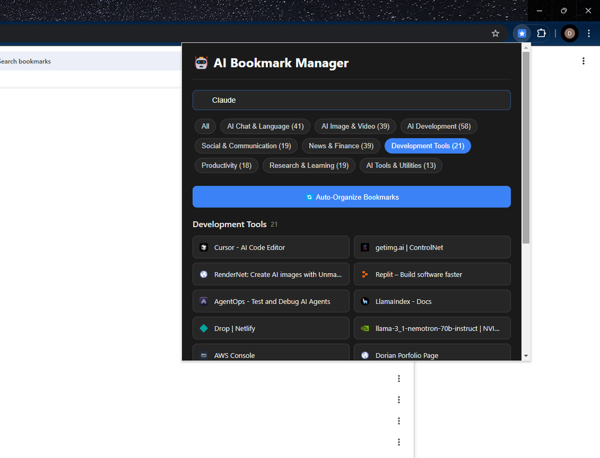

# AI Bookmark Manager Chrome Extension



A powerful Chrome extension that intelligently organizes your AI and technology bookmarks into meaningful categories. Perfect for developers, researchers, and AI enthusiasts who want to keep their growing collection of AI tools and resources well-organized.

## ✨ Key Features

- 🤖 **Smart AI Tool Detection**: Automatically identifies and categorizes AI-related tools and resources
- 🎯 **Precise Categorization**: Uses advanced keyword matching and URL analysis for accurate sorting
- 🔍 **Powerful Search**: Real-time search across your bookmarks with instant results
- 📊 **Category Filtering**: Quick access to bookmarks by category
- 💫 **Modern UI**: Clean, responsive design with smooth animations
- 🌙 **Dark Theme**: Easy on the eyes with a professional dark mode
- ⚡ **Fast & Lightweight**: Works directly in Chrome with no external dependencies

## 🗂️ Smart Categories

The extension automatically organizes your bookmarks into these categories:

### 1. AI Chat & Language
- ChatGPT, Claude, Bard
- Language Models & APIs
- Writing Assistants
- Translation Tools

### 2. AI Image & Video
- Stable Diffusion Tools
- Midjourney
- DALL-E
- Video Generation
- Image Editing

### 3. AI Development
- ML Frameworks
- Model Training
- Jupyter Notebooks
- AI APIs & SDKs
- Development Resources

### 4. Social & Communication
- Professional Networks
- Community Platforms
- Messaging Tools
- Collaboration Spaces

### 5. News & Finance
- Tech News
- Market Analysis
- Crypto & Web3
- Industry Trends

### 6. Development Tools
- GitHub Resources
- Cloud Services
- Development Environments
- Testing & Deployment

### 7. Productivity
- Task Management
- Note-taking
- Project Planning
- Automation Tools

### 8. Research & Learning
- Academic Papers
- Courses & Tutorials
- Documentation
- Educational Resources

### 9. AI Tools & Utilities
- Specialized AI Services
- Data Processing
- Analysis Tools
- Integration Platforms

## 🚀 Installation

1. **Chrome Web Store**
   - Visit the [Chrome Web Store page](https://chromewebstore.google.com/detail/ai-bookmark-manager/mpnmfjocciokodlnmenlopnalmdhaigh)
   - Click "Add to Chrome"
   - Follow the installation prompts

2. **Manual Installation (Developer Mode)**
   ```bash
   # Clone the repository
   git clone https://github.com/yourusername/ai-bookmark-manager.git
   
   # Navigate to Chrome Extensions
   chrome://extensions/
   
   # Enable Developer Mode
   # Click "Load unpacked"
   # Select the chrome-extension directory
   ```

## 🛠️ Usage

1. Click the extension icon in your Chrome toolbar
2. Click "Auto-Organize Bookmarks" to categorize all bookmarks
3. Use the search bar to find specific bookmarks
4. Filter by category using the category buttons
5. Click any bookmark to open it in a new tab

## 🔧 Development

```bash
# Clone the repository
git clone https://github.com/yourusername/ai-bookmark-manager.git

# Navigate to the project directory
cd ai-bookmark-manager

# Make your changes
# Test in Chrome using Developer Mode
```

## 📝 Contributing

Contributions are welcome! Please feel free to submit a Pull Request. For major changes, please open an issue first to discuss what you would like to change.

1. Fork the Project
2. Create your Feature Branch (`git checkout -b feature/AmazingFeature`)
3. Commit your Changes (`git commit -m 'Add some AmazingFeature'`)
4. Push to the Branch (`git push origin feature/AmazingFeature`)
5. Open a Pull Request

## 📄 License

This project is licensed under the MIT License - see the [LICENSE](LICENSE) file for details.

## 🙏 Acknowledgments

- Thanks to all the contributors who have helped with the project
- Special thanks to the Chrome Extensions team for their excellent documentation
- Inspired by the growing need to organize AI tools and resources

## 📞 Support

If you encounter any issues or have questions:

1. Check the [Issues](https://github.com/yourusername/ai-bookmark-manager/issues) page
2. Create a new issue if your problem isn't already listed
3. Provide as much detail as possible, including screenshots if relevant

---

